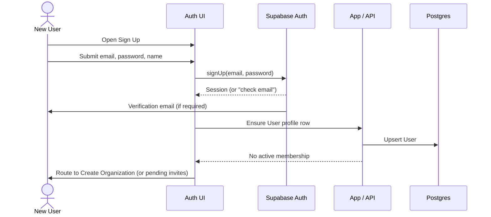
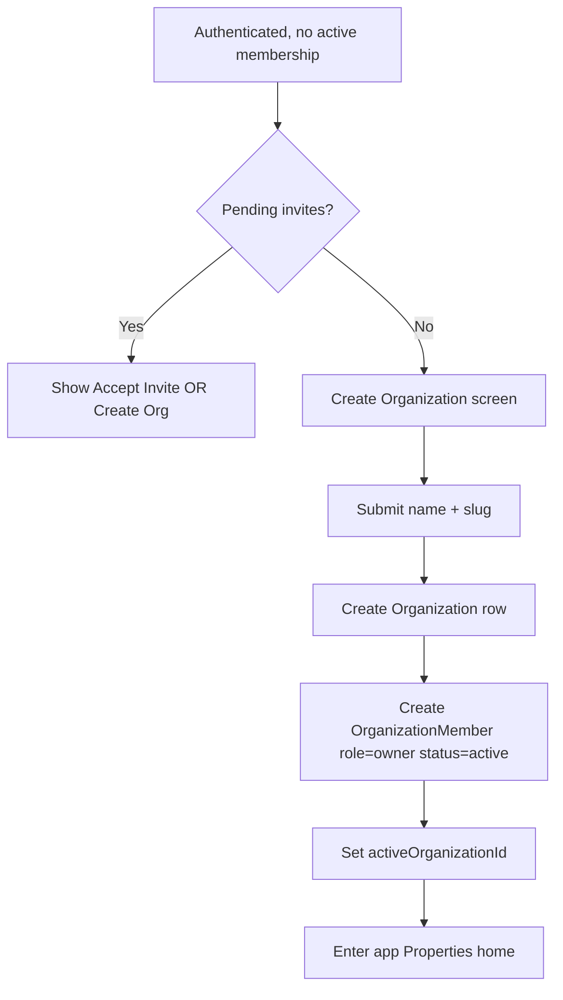
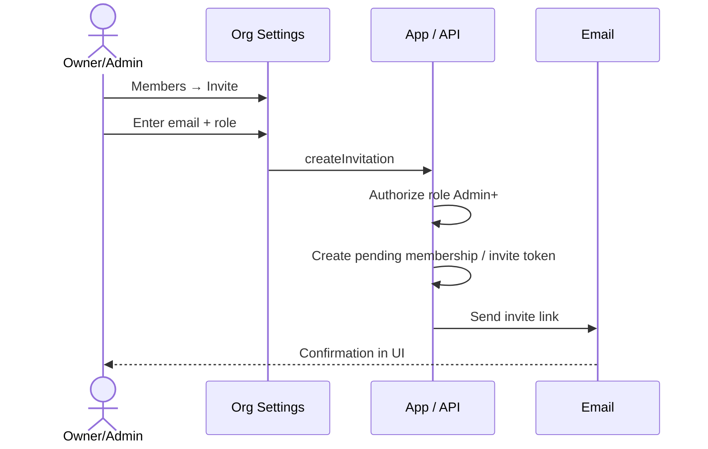
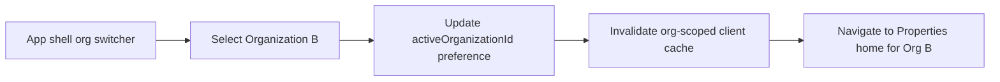
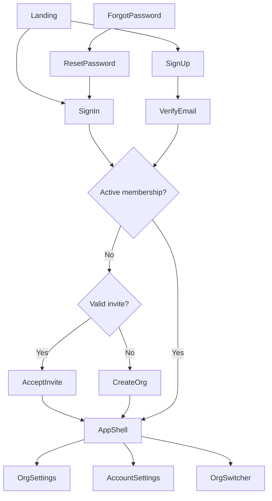

# Authentication & Organization Architecture

> Architecture and UI planning for how people authenticate into Formetrix and
> how Organizations are created, joined, and switched.
>
> Architecture for authentication and organizations. Session middleware and
> protected-route enforcement landed in **FM-0009**. Sign-in/sign-up forms,
> OAuth, migrations, and role enforcement remain future work.

**Status:** Architecture (FM-0008) + session infrastructure (FM-0009).
**Depends on:** `docs/DATABASE_SCHEMA.md` (User, Organization,
OrganizationMember), `docs/DOMAIN_MODEL.md` (§5.1–5.3), FD-0002, ADR-0002,
ADR-0028.
**Related decisions:** ADR-0029 (membership roles), ADR-0030 (active
organization context), ADR-0031 (Mission Control auth policy), ADR-0032
(membership DDL, statuses, RLS helpers).

---

## 1. Purpose

Formetrix is multi-tenant by Organization (FD-0002/FD-0003). Before a User can
evaluate a Property, they must:

1. Authenticate (prove identity).
2. Belong to an Organization via a Membership.
3. Work in an **active organization** context that scopes all business data.

This document defines the end-to-end flows, role model, UI screens, and
security posture so implementation tickets share one design.

---

## 2. Architectural Summary

### 2.1 Identity vs profile vs membership

| Layer                   | Owned by                          | Meaning                                                                        |
| ----------------------- | --------------------------------- | ------------------------------------------------------------------------------ |
| **Auth identity**       | Supabase Auth (ADR-0002)          | Credentials, session, email verification, password reset, future OAuth/SSO/MFA |
| **User profile**        | Application `User` row            | Display name, preferences; `id` = Auth user id                                 |
| **Membership**          | Application `OrganizationMember`  | Links User ↔ Organization with `role` + `status`                               |
| **Active organization** | App session preference (ADR-0030) | Which Organization the UI and queries use right now                            |

Auth never stores Organization ownership. Access always follows Organization
membership + role, never authorship alone (FD-0002, DOMAIN_MODEL §7).

### 2.2 Version 1 policy vs designed capacity

| Concern              | V1 product policy (FD-0002)       | Architecture designed here                                                       |
| -------------------- | --------------------------------- | -------------------------------------------------------------------------------- |
| Memberships per User | Exactly one **active** membership | Schema + switching UX ready for multiple (ADR-0028)                              |
| Roles                | Permissions "may be added later"  | Roles **defined and stored** now; enforcement phased in with auth implementation |
| Org switching        | N/A if only one org               | Designed; UI hidden or no-op until multi-org is enabled                          |

**Implementation rule:** Build screens and APIs so multi-org and role
enforcement can turn on without redesign. Until multi-org is product-enabled,
creating a second active membership is rejected with a clear error, and the
org switcher is not shown.

### 2.3 Planned auth provider stack (not configured in this ticket)

Primary: **Supabase Auth** with email/password.

Designed for later without schema rewrite:

- Google Sign-In (OAuth)
- Microsoft Sign-In (OAuth)
- Magic Links (passwordless email)
- Enterprise SSO (SAML/OIDC via Supabase SSO or equivalent)
- MFA (TOTP / authenticator apps)

All social/SSO paths converge on the same `User` + Membership model after the
Auth identity exists.

---

## 3. Membership Roles

Canonical role enum on `OrganizationMember.role` (extends
`DATABASE_SCHEMA.md`; ADR-0029):

`owner` | `admin` | `member` | `viewer`

Roles are **hierarchical for permission grants**: Owner ⊇ Admin ⊇ Member ⊇
Viewer for ordinary org actions. Owner has exclusive org-lifecycle powers
(transfer ownership, delete organization).

### 3.1 Owner

| Aspect               | Definition                                                                                                                                            |
| -------------------- | ----------------------------------------------------------------------------------------------------------------------------------------------------- |
| **Permissions**      | Full org control: manage billing (future), delete org, transfer ownership, manage all members/invites/roles, all Member capabilities, read everything |
| **Responsibilities** | Accountable for the Organization; ensures at least one Owner always exists; handles ownership transfer before leaving                                 |
| **Future expansion** | Billing admin, legal entity settings, SSO configuration, data-export / GDPR export triggers                                                           |

**Constraints:** Exactly one **primary** Owner is recommended for V1; multiple
Owners may be allowed later. Cannot demote/remove the last Owner.

### 3.2 Admin

| Aspect               | Definition                                                                                                                                                                                          |
| -------------------- | --------------------------------------------------------------------------------------------------------------------------------------------------------------------------------------------------- |
| **Permissions**      | Invite/revoke members; change roles (except grant/remove Owner, and except acting on the last Owner); manage org profile/settings; all Member capabilities; cannot delete org or transfer ownership |
| **Responsibilities** | Day-to-day team administration; keep membership roster accurate                                                                                                                                     |
| **Future expansion** | Assign custom permission sets; manage API keys; configure integrations                                                                                                                              |

### 3.3 Member

| Aspect               | Definition                                                                                                                                                                                 |
| -------------------- | ------------------------------------------------------------------------------------------------------------------------------------------------------------------------------------------ |
| **Permissions**      | Create/edit Properties and evaluation data within the org; invite only if a future "can invite" flag allows (default: **no** invite for Member in V1); cannot manage roles or org settings |
| **Responsibilities** | Perform acquisition/evaluation work on behalf of the Organization                                                                                                                          |
| **Future expansion** | Module-scoped permissions (e.g. financials-only, zoning-only) without inventing new top-level roles                                                                                        |

### 3.4 Viewer

| Aspect               | Definition                                                                                                              |
| -------------------- | ----------------------------------------------------------------------------------------------------------------------- |
| **Permissions**      | Read-only access to Organization Properties and evaluation surfaces; no create/edit/delete; no invites; no org settings |
| **Responsibilities** | Stakeholders who need visibility (partners, lenders, advisors) without write risk                                       |
| **Future expansion** | Share-link / time-boxed view access; property-scoped viewer grants (narrower than org-wide)                             |

### 3.5 Permission matrix (V1 target)

| Action                              | Owner | Admin | Member | Viewer |
| ----------------------------------- | :---: | :---: | :----: | :----: |
| View Properties / workspace         |   ✓   |   ✓   |   ✓    |   ✓    |
| Create / edit Properties & analyses |   ✓   |   ✓   |   ✓    |        |
| Delete Property                     |   ✓   |   ✓   |   ✓*   |        |
| Invite members                      |   ✓   |   ✓   |        |        |
| Change member roles                 |   ✓   |  ✓†   |        |        |
| Revoke membership                   |   ✓   |  ✓†   |        |        |
| Edit org profile / settings         |   ✓   |   ✓   |        |        |
| Transfer ownership                  |   ✓   |       |        |        |
| Delete organization                 |   ✓   |       |        |        |
| Leave organization                  |  ✓‡   |   ✓   |   ✓    |   ✓    |

\* Member delete of Property: allowed unless product later restricts.
† Admin cannot modify Owners or the last Owner.
‡ Owner may leave only after transferring ownership (or deleting the org).

**Enforcement location:** server-side (RLS + service-layer checks). UI hides
actions the role cannot perform; UI alone is never sufficient.

---

## 4. Invitation Model

Invitations are first-class before acceptance.

### 4.1 Logical fields (implementation may fold into `OrganizationMember`)

| Field             | Notes                                                                             |
| ----------------- | --------------------------------------------------------------------------------- |
| `organizationId`  | Target org                                                                        |
| `email`           | Invitee email (normalized lowercase)                                              |
| `role`            | Role granted on accept (`admin` \| `member` \| `viewer`; Owner only via transfer) |
| `token`           | High-entropy opaque token (not the membership id)                                 |
| `invitedByUserId` | Actor                                                                             |
| `expiresAt`       | Default e.g. 7 days                                                               |
| `status`          | `pending` \| `accepted` \| `revoked` \| `expired`                                 |
| `acceptedAt`      | Set on accept                                                                     |

**Schema alignment:** Prefer extending `OrganizationMember` with
`invitedEmail`, `inviteTokenHash`, `invitedByUserId`, `inviteExpiresAt` while
`status = invited`, then transition to `active` and bind `userId` on accept
(see DATABASE_SCHEMA §4 extension points). Store **hash** of token, not
plaintext.

### 4.2 Invitation rules

- Only Owner/Admin may create invitations.
- Duplicate pending invite for same `(organizationId, email)` is rejected or
  replaces the previous pending invite (pick one in implementation; prefer
  **replace + invalidate old token**).
- Accept requires authenticated User whose email matches the invite (case-
  insensitive), or sign-up that establishes that email then accept.
- Expired/revoked tokens never activate membership.
- Invitation does not grant access until `status = active`.

---

## 5. Active Organization Context

**ADR-0030.** After authentication, every request that touches business data
resolves an **active organization id**:

1. Prefer a persisted preference (cookie / user setting:
   `activeOrganizationId`).
2. Else the User's sole `active` membership.
3. Else (multi-org later) last-used or prompt to choose.
4. If no active membership → onboarding (create org or accept invite).

Switching organization updates the preference and reloads org-scoped routes.
V1 with one membership: preference always equals that membership's org.

---

## 6. User Journeys

### 6.1 New user creates an account



**Notes:** Unverified email may sign in with limited capability; Property
access requires verified email (see §10). Profile may exist before membership
(DOMAIN_MODEL OQ-9 posture: allow profile, block org data).

### 6.2 Creates first organization



### 6.3 Invites another user



### 6.4 Existing user joins via invitation

```mermaid
sequenceDiagram
  actor I as Invitee
  participant Link as Invite Link
  participant Auth as Auth
  participant App as App

  I->>Link: Open /invite/[token]
  Link->>App: Validate token (hash, expiry, status)
  alt Not signed in
    App-->>I: Sign in or Sign up (email prefilled)
    I->>Auth: Authenticate
  end
  App->>App: Email must match invite
  App->>App: Activate membership; set role
  App->>App: Set activeOrganizationId
  App-->>I: Land in org Properties
```

If V1 one-org policy is still on and invitee already has an active membership
elsewhere → show conflict: decline, or (later) allow multi-org when policy
lifts.

### 6.5 User belongs to multiple organizations

Designed for post–FD-0002 multi-org enablement:

- User may have multiple `OrganizationMember` rows with `status = active`.
- Org switcher lists all active memberships (name + role).
- Data queries always filter by `activeOrganizationId`.
- Leaving one org does not delete the User or other memberships.

### 6.6 User switches active organization



No cross-org data bleed: Property ids from Org A must 404 / 403 under Org B
context (RLS + active-org check).

---

## 7. Auth Flows (Credential Lifecycle)

### 7.1 Sign Up

1. Collect email, password, full name (optional display name).
2. Create Auth user; create/upsert `User` profile.
3. Send verification email (Supabase).
4. Route: pending invites → accept; else → create organization.

### 7.2 Sign In

1. Email + password (later: OAuth / magic link entry points on same screen).
2. Establish session (cookie via `@supabase/ssr` — implementation ticket).
3. Resolve active organization; if none → onboarding.

### 7.3 Password Reset

1. Request reset with email (always show generic success to avoid enumeration).
2. Email with time-limited recovery link (Auth-managed).
3. Set new password; optionally revoke other sessions.
4. Redirect to Sign In (or auto sign-in if Auth returns a session).

### 7.4 Email Verification

1. After sign-up, show "Check your email" with resend control (rate-limited).
2. Click verify link → Auth marks email confirmed.
3. App gate: org-mutating and Property write paths require verified email.
4. Unverified users may still accept invites / create org only if product
   chooses; **recommendation:** allow create-org, block Property writes until
   verified.

---

## 8. UI Planning

No React components in this ticket. Route names are planning targets under
`src/app/` when implemented.

### 8.1 Screen list

| ID  | Screen                           | Route (planned)                   | Audience                                        |
| --- | -------------------------------- | --------------------------------- | ----------------------------------------------- |
| A1  | Sign In                          | `/auth/sign-in`                   | Anonymous                                       |
| A2  | Sign Up                          | `/auth/sign-up`                   | Anonymous                                       |
| A3  | Check Email / Verify notice      | `/auth/verify-email`              | Signed-up, unverified                           |
| A4  | Forgot Password                  | `/auth/forgot-password`           | Anonymous                                       |
| A5  | Reset Password                   | `/auth/reset-password`            | Recovery session                                |
| A6  | Accept Invitation                | `/invite/[token]`                 | Anonymous or authenticated                      |
| O1  | Create Organization              | `/onboarding/organization`        | Authenticated, no active membership             |
| O2  | Organization Settings — General  | `/settings/organization`          | Owner/Admin                                     |
| O3  | Organization Settings — Members  | `/settings/organization/members`  | Owner/Admin (+ Members read-only list optional) |
| O4  | Organization Switcher            | Shell control (not a full page)   | Multi-membership users                          |
| U1  | Account Settings — Profile       | `/settings/account`               | Authenticated                                   |
| U2  | Account Settings — Security      | `/settings/account/security`      | Authenticated                                   |
| U3  | Account Settings — Organizations | `/settings/account/organizations` | Authenticated                                   |

Protected app shell (Properties, etc.) assumes authenticated + active org.

### 8.2 Navigation flow



Unauthenticated access to protected routes → redirect to `/auth/sign-in`
with a sanitized `?next=` return path (FM-0009). Authenticated without org →
onboarding, not the Properties list (future).

### 8.3 Form fields

**Sign Up:** `fullName`, `email`, `password`, `confirmPassword` (optional if
inline strength UX is clear).

**Sign In:** `email`, `password`; future: provider buttons, "Email me a magic
link".

**Forgot Password:** `email`.

**Reset Password:** `password`, `confirmPassword`.

**Create Organization:** `name` (required), `slug` (required, unique, URL-safe;
auto-suggested from name).

**Invite Member:** `email`, `role` (`admin` \| `member` \| `viewer`).

**Account Profile:** `fullName`, `email` (read-only or change-via-Auth flow).

**Security:** change password (current + new); future MFA enrollment.

### 8.4 Validation rules

| Field            | Rules                                                                                                                           |
| ---------------- | ------------------------------------------------------------------------------------------------------------------------------- |
| Email            | Required; valid format; normalize lowercase for storage/compare                                                                 |
| Password         | Min 12 characters; at least one letter and one number; block common passwords if feasible; max length ≥ 64 to allow passphrases |
| Confirm password | Must match                                                                                                                      |
| Full name        | 1–120 chars; trim whitespace                                                                                                    |
| Org name         | 2–80 chars                                                                                                                      |
| Org slug         | `^[a-z0-9]+(?:-[a-z0-9]+)*$`; 2–48 chars; unique globally                                                                       |
| Invite role      | Not `owner`                                                                                                                     |

Client validation for UX; **server validation authoritative**.

### 8.5 Error states

| Situation                                | User-facing guidance                                  |
| ---------------------------------------- | ----------------------------------------------------- |
| Invalid credentials                      | Generic: "Email or password is incorrect."            |
| Unverified email on gated action         | "Verify your email to continue." + Resend             |
| Email already registered (sign-up)       | Prefer Auth-safe messaging; offer Sign In             |
| Weak password                            | Inline checklist of failed rules                      |
| Invite expired / revoked / invalid       | "This invitation is no longer valid." + contact admin |
| Invite email mismatch                    | "Sign in with the invited email address."             |
| Slug taken                               | "That organization URL is taken."                     |
| Second org while V1 single-org policy on | "You already belong to an organization."              |
| Insufficient role                        | "You don't have permission to do that."               |
| Rate limited                             | "Too many attempts. Try again later."                 |
| Network / Auth outage                    | Retry + non-secret error id                           |

Avoid user enumeration on forgot-password and, where possible, on sign-up.

### 8.6 Empty states

| Screen                       | Empty state                                                          |
| ---------------------------- | -------------------------------------------------------------------- |
| Members list                 | "No teammates yet. Invite someone to collaborate." (Owner/Admin CTA) |
| Account → Organizations      | Single org: show current membership; multi: list all                 |
| Pending invites (onboarding) | If none: only Create Organization                                    |
| Org switcher                 | Hidden when ≤1 active membership                                     |

### 8.7 Future MFA support

- Security settings: "Authenticator app" enroll / disable.
- Sign-in: after password (or SSO), challenge TOTP when enrolled.
- Recovery codes generated at enroll; stored hashed.
- Org-level future: "Require MFA for all members" (Owner/Admin policy).
- Do not block V1 email/password on MFA; design settings + session AAL
  (authenticator assurance) hooks now.

---

## 9. Account Settings

| Area          | Capabilities                                            |
| ------------- | ------------------------------------------------------- |
| Profile       | Edit display name; show email; avatar later             |
| Security      | Change password; view sessions (future); MFA (future)   |
| Organizations | List memberships + roles; leave org; switch (multi-org) |
| Danger zone   | Delete account (Owner must transfer/delete org first)   |

Leaving an Organization: set membership `revoked` (or delete row — prefer
**revoked** for audit). Last Owner cannot leave without transfer.

---

## 10. Security Considerations

### 10.1 Session management

- Prefer **httpOnly, Secure, SameSite** cookies via `@supabase/ssr`.
- Short-lived access token + refresh token rotation (Supabase defaults).
- Middleware refreshes session on protected routes (FM-0009 scope).
- Sign-out clears cookies client + server; optional global sign-out.
- Idle timeout: product-configurable later; not required for first ship.

### 10.2 Email verification

- Treat Auth `email_confirmed_at` as source of truth.
- Gate sensitive mutations until verified.
- Resend verification rate-limited per email/IP.

### 10.3 Password policy

- Minimum 12 characters; encourage passphrases.
- Supabase Auth password settings aligned with app validation.
- Reset links single-use / short TTL.
- After reset, invalidate other refresh tokens when supported.

### 10.4 Invitation security

- Opaque tokens (≥ 128 bits entropy); store **SHA-256 hash** only.
- TTL (e.g. 7 days); revoke on demand.
- HTTPS-only invite URLs.
- Bind accept to verified matching email.
- Do not leak whether an email already has an account in invite UI beyond
  what's needed for routing (sign-in vs sign-up).

### 10.5 Role enforcement

- Enforce on **every** mutating API and via **RLS** policies keyed by
  `organizationId` + membership role/status.
- Active org context cannot elevate role; role comes from membership row.
- UI capability checks are advisory.

### 10.6 Audit logging

Log at minimum (append-only, org-scoped where applicable):

- Sign-in success/failure (Auth + app)
- Password change / reset
- Email verification
- Organization created / deleted
- Invitation created / accepted / revoked
- Role changes
- Membership revoked / left
- Active organization switches (optional, privacy-light)

Retain actor user id, org id, timestamp, action, metadata (no raw passwords
or invite tokens).

### 10.7 Future SSO

- Enterprise orgs map IdP groups → Formetrix roles later.
- SSO users still get `User` + `OrganizationMember` rows.
- Password login may be disabled per org when SSO is mandatory.
- Design org settings stub: "Single sign-on (coming soon)".

---

## 11. Future Compatibility

| Capability                 | Design hook                                                                        |
| -------------------------- | ---------------------------------------------------------------------------------- |
| Supabase Auth              | Sole identity provider boundary (ADR-0002); app never stores password hashes       |
| Google / Microsoft Sign-In | Same Sign In screen; post-OAuth ensures User row + continues membership resolution |
| Magic Links                | Alternate credential on Sign In; same session + membership path                    |
| Enterprise SSO             | Org-level SSO config; jit-provision User + membership on first login               |
| MFA                        | Security settings + sign-in second factor; session assurance level                 |
| Multi-org                  | Already in schema (ADR-0028); enable switcher + lift FD-0002 app constraint        |
| Fine-grained permissions   | Keep four roles; add grant table later without renaming roles                      |

---

## 12. Implementation Status (FM-0009)

### 12.1 What shipped

| Piece                  | Location                                                         |
| ---------------------- | ---------------------------------------------------------------- |
| Root middleware        | `src/middleware.ts`                                              |
| Session refresh        | `src/lib/supabase/middleware.ts` → `updateSession` (`getClaims`) |
| Route policy           | `src/lib/auth/routes.ts`                                         |
| Return-path safety     | `src/lib/auth/return-path.ts`                                    |
| Server user resolution | `src/lib/auth/get-authenticated-user.ts` (`getUser`)             |
| Auth placeholders      | `/auth/sign-in`, `/auth/sign-up` (no forms)                      |

### 12.2 Public vs protected

| Class     | Paths                                                                                        | Behavior                                                                     |
| --------- | -------------------------------------------------------------------------------------------- | ---------------------------------------------------------------------------- |
| Public    | `/`, other non-protected paths                                                               | No session required                                                          |
| Auth      | `/auth/sign-in`, `/auth/sign-up`                                                             | Placeholders; authenticated users redirect to `/properties` (or safe `next`) |
| Protected | `/properties`, `/property/*`, `/settings`, `/settings/*`, `/organization`, `/organization/*` | Require verified session when Supabase is configured                         |
| Internal  | `/internal/project-dashboard`                                                                | **Public for now** (ADR-0031) — Mission Control without Auth                 |

### 12.3 Middleware behavior

1. Call `updateSession` (refresh cookies via `getClaims`).
2. If path is protected and Supabase is **unconfigured** → redirect to `/auth/sign-in?error=supabase_unconfigured&next=…` (no fake session).
3. If path is protected, configured, and no `userId` → redirect to `/auth/sign-in?next=…`.
4. If path is an auth route, configured, and signed in → redirect to sanitized `next` or `/properties`.
5. Matcher skips `_next/static`, `_next/image`, `favicon.ico`, and common image extensions.

### 12.4 Return-path safety

Only same-app relative paths starting with a single `/` are accepted. Rejected:
`//…`, `https://…`, auth routes, control characters, backslashes. Unsafe values
fall back to `/properties`.

### 12.5 Unconfigured Supabase

- Public routes (including home and Mission Control) continue to load.
- Protected routes never open as if the user were signed in.
- `/auth/sign-in?error=supabase_unconfigured` renders a **branded configuration
  screen** (not the global unexpected-error page): required env var **names**,
  safe return path, restart-dev-server note. No secret values. No sign-in form.
- Required public vars: `NEXT_PUBLIC_SUPABASE_URL` and
  `NEXT_PUBLIC_SUPABASE_PUBLISHABLE_KEY` (legacy `NEXT_PUBLIC_SUPABASE_ANON_KEY`
  accepted as fallback — ADR-0037). Server-only: `SUPABASE_SERVICE_ROLE_KEY`
  (ingestion; never `NEXT_PUBLIC_`).
- After editing `.env.local`, restart `npm run dev`. See README Founder checklist
  for where to copy URL / publishable / service_role / project ref / DB password
  from the hosted dashboard — never paste secrets into chat.

### 12.6 Organization membership (FM-0010)

- SQL + RLS: `supabase/migrations/` (`user_profiles`, `organizations`,
  `organization_memberships`). **Not auto-applied.**
- Statuses: `invited` \| `active` \| `suspended` \| `removed` (ADR-0032).
- Helpers: `@/lib/organizations` — profile, current org, membership/role
  requirements, list orgs. Active org = verified preference or sole active
  membership (V1 one-active index).
- Role hierarchy and self-elevation rejection are centralized in
  `roles.ts` (+ SQL trigger).
- Still deferred: onboarding UI, invitation email/accept pages, org switcher UI.

### 12.7 Still out of scope

- Sign-in / sign-up forms, password reset, email verification UI
- Organization onboarding UI, invitation delivery/acceptance pages
- OAuth, magic links, MFA, SSO
- Applying migrations to a live Supabase project from this repo's scripts
- Replacing the client `AuthProvider` placeholder with live `onAuthStateChange`

---

## 13. Open Points (Non-Blocking)

1. Whether multiple Owners are allowed in the first enforcement pass.
2. Whether unverified users may create an Organization (recommended yes) vs
   must verify first.
3. Exact invite TTL and whether pending invites count toward seat limits.
4. When FD-0002 multi-org deferral is lifted (founder); architecture is ready.
5. Whether Member may delete Properties in V1 (matrix assumes yes).

---

## 14. Document History

| Date       | Change                                                                 |
| ---------- | ---------------------------------------------------------------------- |
| 2026-07-31 | Initial architecture for FM-0008                                       |
| 2026-07-31 | FM-0009: session middleware, route policy, `/auth/*` paths, §12 status |
| 2026-07-31 | FM-0010: membership DDL/RLS, org helpers, statuses, §12.6              |
| 2026-07-31 | FM-0005: publishable key + unconfigured screen + env/CLI docs §12.5    |
