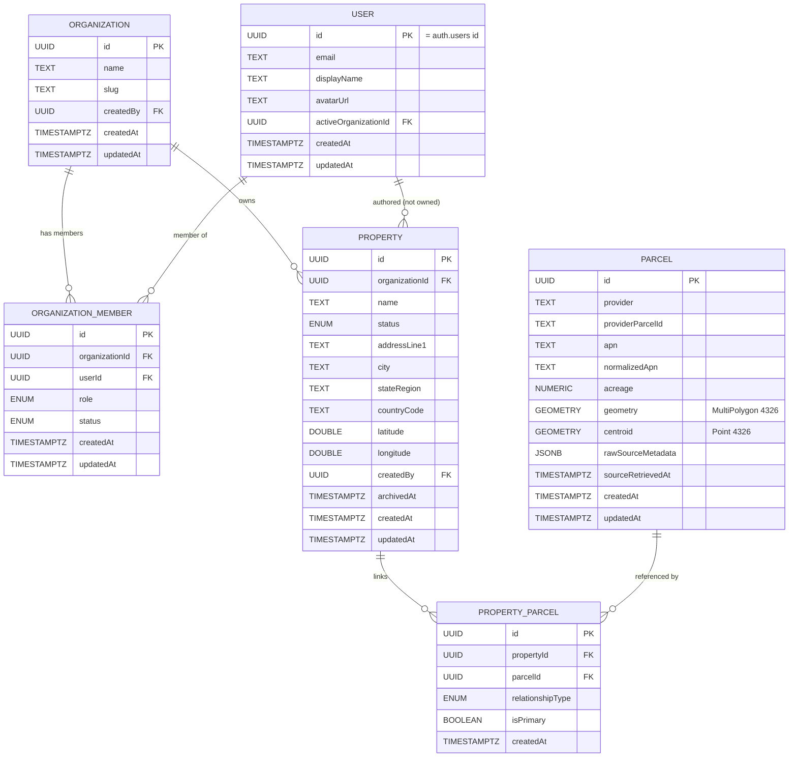

# Formetrix Core Database Schema

> The foundational data model for Formetrix (FM-0007 design; FM-0010
> membership DDL). Logical types are documented here; migration-ready SQL for
> `user_profiles`, `organizations`, and `organization_memberships` lives under
> `supabase/migrations/` and is **not applied automatically**.
>
> This document is downstream of `docs/DOMAIN_MODEL.md` (the founder-approved
> business vocabulary) and the founder decisions in
> `management/FOUNDER_DECISIONS.md`. Where a naming or shape choice is made, it
> traces back to a decision recorded in `management/DECISIONS.md`.

**Status:** Design approved for the five core entities below (FM-0007). Parcel,
Zoning, Constraints, Assumptions, Scenario/Financial, Recommendation,
Documents, and Activity are named here **only as extension points** — their
schemas are deliberately not designed in this ticket.

**Scope:** the five core entities — **User, Organization, OrganizationMember,
Property, PropertyWorkspace** — with fields, types, keys, constraints,
relationships, ownership/tenancy, and extension points.

---

## 1. Design Principles

- **Normalized.** One fact lives in one place. Land facts (APN, acreage,
  zoning) live on the future **Parcel** record, not duplicated onto Property —
  a Property may reference many parcels (ADR-0012), so a single APN/zoning on
  Property would be lossy and quickly wrong.
- **Multi-tenant by Organization.** Organization is the tenancy boundary
  (FD-0002/FD-0003). Every business row is Organization-scoped and carries
  `organizationId`, so Row Level Security can scope access by a single column
  when Supabase is wired later (FORMETRIX.md §19; out of scope here).
- **Simple and scalable.** UUID primary keys, `timestamptz` audit columns,
  surrogate keys over natural keys, and join tables for many-to-many. No
  premature optimization (no partitioning, sharding, or denormalization caches
  before a measured need — FORMETRIX.md §11/§21).
- **Authorship ≠ ownership.** Rows may record which User authored/last-touched
  them for traceability (FORMETRIX.md §7), but **access follows Organization
  ownership**, never the authoring User (FD-0002, DOMAIN_MODEL §7).
- **Production-ready shape, phased implementation.** The lifecycle and
  membership shapes are sized for where the product is going (FD-0004/FD-0002)
  even though V1 only exercises part of them.

**Conventions used below:** `UUID` (surrogate PK/FK), `TEXT`, `TIMESTAMPTZ`
(UTC), `NUMERIC` (exact decimal), `DOUBLE PRECISION` (lat/long),
`BOOLEAN`, and `ENUM` (a constrained string set). "Auth-owned" marks data
managed by Supabase Auth (ADR-0002), referenced but not redefined here.

---

## 2. Entity: User

**Purpose.** The authentication identity of a person who signs in
(DOMAIN_MODEL §5.2). The credential-holding account itself is owned by Supabase
Auth (ADR-0002); this record is the application-side **profile** that hangs off
that identity, so profile data can change without touching credentials.

| Field                  | Type        | Required | Notes                                                                                            |
| ---------------------- | ----------- | -------- | ------------------------------------------------------------------------------------------------ |
| `id`                   | UUID        | yes      | **PK.** Matches Supabase Auth user id (`authUserId` in TypeScript is the same value — ADR-0032). |
| `email`                | TEXT        | yes      | Mirrored from Auth for display/lookups; Auth remains authoritative.                              |
| `displayName`          | TEXT        | no       | Profile display name (SQL: `display_name`; was sketched as `fullName`).                          |
| `avatarUrl`            | TEXT        | no       | Profile image.                                                                                   |
| `activeOrganizationId` | UUID        | no       | Preferred active org; **must be verified** against an active membership before use (ADR-0030).   |
| `createdAt`            | TIMESTAMPTZ | yes      | Profile creation.                                                                                |
| `updatedAt`            | TIMESTAMPTZ | yes      | Last profile change.                                                                             |

- **Table:** `user_profiles`.
- **Primary key:** `id`.
- **Foreign keys:** `id` → `auth.users`; `activeOrganizationId` → Organization (nullable, ON DELETE SET NULL).
- **Unique constraints:** `id`; `email` unique.
- **Relationships:** a User connects to Organizations only through
  **OrganizationMember** (§4) — never a direct ownership `organizationId` on User.
- **Extension points:** `phone`, `locale`, `timezone`, notification
  preferences, `lastSeenAt`; a separate `user_preferences` table if preferences
  grow.

---

## 3. Entity: Organization

**Purpose.** A company or business account — the **tenancy and ownership
boundary** for all business data and billing (DOMAIN_MODEL §5.1, FD-0002). A
solo developer still has exactly one Organization.

| Field       | Type        | Required | Notes                                                        |
| ----------- | ----------- | -------- | ------------------------------------------------------------ |
| `id`        | UUID        | yes      | **PK.**                                                      |
| `name`      | TEXT        | yes      | Display name of the company/account (2–80 chars).            |
| `slug`      | TEXT        | yes      | URL-safe unique handle (`^[a-z0-9]+(?:-[a-z0-9]+)*$`, 2–48). |
| `createdBy` | UUID        | no       | FK → User profile that created the org.                      |
| `createdAt` | TIMESTAMPTZ | yes      |                                                              |
| `updatedAt` | TIMESTAMPTZ | yes      |                                                              |

- **Table:** `organizations`.
- **Primary key:** `id`.
- **Foreign keys:** `createdBy` → `user_profiles` (ON DELETE SET NULL).
- **Unique constraints:** `id`; `slug` unique.
- **Relationships:** has many Users through **OrganizationMember** (§4); owns
  many **Property** records (§5) — Property tables are not in FM-0010.
- **Extension points:** `billingCustomerId` (payments), `plan`/`tier`,
  `settings` (JSON for org-level configuration), `logoUrl`. Membership roles
  (`owner`/`admin`/`member`/`viewer`) are defined in `docs/AUTH_FLOW.md`
  (ADR-0029); finer-grained permission grants beyond those four roles remain
  deferred (FD-0002).

---

## 4. Entity: OrganizationMember

**Purpose.** The **Membership** concept (DOMAIN_MODEL §5.3): the fact that a
specific User belongs to a specific Organization. Modeled as its own join
entity — not a flat `organizationId` on User — because a membership can end
without deleting the User, and because multi-organization membership is
deferred, not ruled out (FD-0002).

| Field            | Type        | Required | Notes                                                                                          |
| ---------------- | ----------- | -------- | ---------------------------------------------------------------------------------------------- |
| `id`             | UUID        | yes      | **PK.**                                                                                        |
| `organizationId` | UUID        | yes      | **FK** → Organization.                                                                         |
| `userId`         | UUID        | yes      | **FK** → User profile.                                                                         |
| `role`           | ENUM        | yes      | `owner` \| `admin` \| `member` \| `viewer` (ADR-0029).                                         |
| `status`         | ENUM        | yes      | `invited` \| `active` \| `suspended` \| `removed` (ADR-0032; replaces earlier `revoked` name). |
| `invitedBy`      | UUID        | no       | FK → User who created the invite.                                                              |
| `joinedAt`       | TIMESTAMPTZ | no       | Set when status becomes `active`.                                                              |
| `createdAt`      | TIMESTAMPTZ | yes      | When the membership (or invite) was created.                                                   |
| `updatedAt`      | TIMESTAMPTZ | yes      |                                                                                                |

- **Table:** `organization_memberships`.
- **Primary key:** `id`.
- **Foreign keys:** `organizationId` → Organization (CASCADE); `userId` →
  `user_profiles` (CASCADE); `invitedBy` → `user_profiles` (SET NULL).
- **Unique constraints:** composite unique **(`organizationId`, `userId`)**.
- **V1 index:** unique partial index on `user_id` where `status = 'active'` —
  enforces one active organization context per user (FD-0002). Drop/replace
  when multi-org is product-enabled; structural many-to-many remains.
- **Self-elevation guard:** trigger blocks a user from changing their own
  `role` column; RLS uses `SECURITY DEFINER` helpers `is_active_org_member` /
  `has_org_role` (see `supabase/migrations/20260731200100_*.sql`).
- **Extension points:** `invitedEmail` (invite before a User row exists),
  invite token hash fields (AUTH_FLOW §4), and a future permission-grant table.

---

## 5. Entity: Property

**Purpose.** The **long-lived acquisition/development opportunity**, owned by an
Organization, carried through its lifecycle (DOMAIN_MODEL §5.4, FD-0004). This
is the entity everything else ultimately relates back to. It is **not** a
Parcel (the land record) and is **not** replaced by a "Project" at acquisition
(ADR-0011, ADR-0013).

| Field            | Type             | Required | Notes                                                                                                        |
| ---------------- | ---------------- | -------- | ------------------------------------------------------------------------------------------------------------ |
| `id`             | UUID             | yes      | **PK.**                                                                                                      |
| `organizationId` | UUID             | yes      | **FK** → Organization. The tenancy/ownership anchor.                                                         |
| `name`           | TEXT             | yes      | User-facing label for the opportunity.                                                                       |
| `addressLine1`   | TEXT             | no       | A Property may be created before its address/parcel is confirmed (FD-0003).                                  |
| `addressLine2`   | TEXT             | no       |                                                                                                              |
| `city`           | TEXT             | no       |                                                                                                              |
| `stateRegion`    | TEXT             | no       | State/region.                                                                                                |
| `postalCode`     | TEXT             | no       |                                                                                                              |
| `countryCode`    | TEXT             | no       | ISO country code.                                                                                            |
| `latitude`       | DOUBLE PRECISION | no       | **Display pin only** — authoritative geometry lives on Parcel (PostGIS). Pair with `longitude` or both null. |
| `longitude`      | DOUBLE PRECISION | no       | See `latitude`.                                                                                              |
| `status`         | ENUM             | yes      | V1 lifecycle (below). Default `discovered`.                                                                  |
| `createdBy`      | UUID             | no       | **FK** → User profile. Authorship, not ownership (FD-0002).                                                  |
| `createdAt`      | TIMESTAMPTZ      | yes      |                                                                                                              |
| `updatedAt`      | TIMESTAMPTZ      | yes      |                                                                                                              |
| `archivedAt`     | TIMESTAMPTZ      | no       | Set when status becomes `archived` (soft archive timestamp).                                                 |

- **Table:** `properties` (FM-0011 migration).

**Lifecycle `status` (ENUM), FD-0004:**

- **Version 1 (implemented):** `discovered`, `evaluating`, `under_contract`,
  `acquired`, `archived`.
- **Deferred (named so the enum shape never needs a breaking change; not built
  in V1):** `planning`, `design`, `permitting`, `construction`, `completed`.

This exactly matches the shipped `PropertyStatus` type in
`src/features/properties/types.ts` (FM-0029) — the schema and the first product
feature agree on the vocabulary.

- **Primary key:** `id`.
- **Foreign keys:** `organizationId` → Organization; `createdBy` → User profile.
- **Unique constraints:** `id`. (No natural-key uniqueness — two Organizations
  may track the same address as separate opportunities.)
- **Relationships:** owned by one Organization; many-to-many with **Parcel**
  via `property_parcels` (§5a); has exactly one **PropertyWorkspace** (§6) in V1
  (workspace table still deferred until an analysis-module ticket needs it).

**Deliberately NOT on Property — APN, acreage, zoning, boundary geometry.**
Those live on shared **Parcel** (§5a). Property may store an optional map pin
(`latitude`/`longitude`) for UX before parcels are attached.

- **Extension points:** `summary`, `dealValueEstimate`, `targetCloseDate`,
  `lastUpdatedByUserId`.

---

## 5a. Entity: Parcel (shared) & PropertyParcel (FM-0011)

### Parcel

**Purpose.** Shareable land reference record (DOMAIN_MODEL §5.6, FD-0005,
ADR-0012). Never stores Organization-private analysis.

| Field               | Type                          | Required | Notes                                                               |
| ------------------- | ----------------------------- | -------- | ------------------------------------------------------------------- |
| `id`                | UUID                          | yes      | **PK.**                                                             |
| `provider`          | TEXT                          | yes      | e.g. `regrid` (future). Part of natural key.                        |
| `providerParcelId`  | TEXT                          | yes      | Provider's stable id. Unique with `provider`.                       |
| `apn`               | TEXT                          | no       | Display APN.                                                        |
| `normalizedApn`     | TEXT                          | no       | Uppercase alphanumeric for lookup.                                  |
| `county`            | TEXT                          | no       |                                                                     |
| `stateRegion`       | TEXT                          | no       |                                                                     |
| `countryCode`       | TEXT                          | no       |                                                                     |
| `situsAddress`      | TEXT                          | no       |                                                                     |
| `acreage`           | NUMERIC                       | no       | Acres (US), provider-reported — not recomputed from geometry in V1. |
| `geometry`          | `geometry(MultiPolygon,4326)` | no       | Source boundary (EPSG:4326). Multipart-capable.                     |
| `centroid`          | `geometry(Point,4326)`        | no       | Synced from geometry via trigger when boundary present.             |
| `geometrySource`    | TEXT                          | no       | How geometry was obtained.                                          |
| `sourceRetrievedAt` | TIMESTAMPTZ                   | no       | When Formetrix retrieved the payload.                               |
| `sourceUpdatedAt`   | TIMESTAMPTZ                   | no       | Provider's last-updated timestamp if known.                         |
| `rawSourceMetadata` | JSONB                         | yes      | Provider snapshot for provenance (default `{}`).                    |
| `geometryQuality`   | ENUM                          | no       | `high` \| `medium` \| `low` \| `unknown`.                           |
| `createdAt`         | TIMESTAMPTZ                   | yes      |                                                                     |
| `updatedAt`         | TIMESTAMPTZ                   | yes      |                                                                     |

- **Table:** `parcels`.
- **Unique:** `(provider, providerParcelId)`.
- **Indexes:** GIST on `geometry` and `centroid`; btree on `normalizedApn`.
- **Provenance refresh:** Regrid ingestion (FM-0012) upserts attributes /
  `raw_source_metadata` and timestamps without deleting the row; identity stays
  `(provider, providerParcelId)`. No multi-version history table yet.
- **SRID:** **4326 (WGS 84)** — nationally scalable lon/lat, web-map native
  (ADR-0033). Derived development geometry is out of scope (separate from
  source geometry per FORMETRIX.md §14).

### PropertyParcel

| Field              | Type        | Required | Notes                                                   |
| ------------------ | ----------- | -------- | ------------------------------------------------------- |
| `id`               | UUID        | yes      | **PK.**                                                 |
| `propertyId`       | UUID        | yes      | **FK** → Property (CASCADE).                            |
| `parcelId`         | UUID        | yes      | **FK** → Parcel (RESTRICT).                             |
| `relationshipType` | ENUM        | yes      | `primary_site` \| `component` \| `adjacent` \| `other`. |
| `isPrimary`        | BOOLEAN     | yes      | At most one `true` per Property (partial unique).       |
| `createdAt`        | TIMESTAMPTZ | yes      |                                                         |

- **Table:** `property_parcels`.
- **Unique:** `(propertyId, parcelId)`.
- **Privacy:** join is readable only if the caller can access the Property;
  Parcel rows themselves have no org id and must not contain private Property
  fields.

---

## 6. Entity: PropertyWorkspace

**Purpose.** The **evaluation surface** of a Property — the container that every
future analysis module attaches to (FM-0007's Workspace Model; ADR-0027). It
keeps the core **Property** record (identity, ownership, lifecycle) stable and
small, while the mutable, module-heavy evaluation data hangs off the workspace.
It is the persistence backing for the `/property/[id]` workspace shipped in
FM-0029, whose sections are exactly the extension points below.

| Field            | Type        | Required | Notes                                                                             |
| ---------------- | ----------- | -------- | --------------------------------------------------------------------------------- |
| `id`             | UUID        | yes      | **PK.**                                                                           |
| `propertyId`     | UUID        | yes      | **FK** → Property. **Unique** — one workspace per Property in V1.                 |
| `organizationId` | UUID        | yes      | **FK** → Organization. Denormalized from Property so RLS can scope by one column. |
| `createdAt`      | TIMESTAMPTZ | yes      |                                                                                   |
| `updatedAt`      | TIMESTAMPTZ | yes      |                                                                                   |

- **Primary key:** `id`.
- **Foreign keys:** `propertyId` → Property; `organizationId` → Organization.
- **Unique constraints:** `propertyId` unique (enforces 1:1 with Property in
  V1). Modeled as its own entity so the analysis modules FK to
  `propertyWorkspaceId` rather than `propertyId` directly — which lets a
  Property later hold more than one independent workspace (e.g., parallel
  evaluations) without a migration to every module.
- **Relationship to the domain model:** a deliberate refinement of
  DOMAIN_MODEL §5.4's "Property is the workspace" (ADR-0027). Property remains
  the primary, long-lived, Organization-owned record; PropertyWorkspace is the
  1:1 evaluation surface analysis modules attach to. It is **not** a "Project"
  (ADR-0013) — it does not carry lifecycle or ownership, only evaluation
  attachment.

### Extension points (future modules — NOT designed in FM-0007)

Each attaches to `propertyWorkspaceId` (and carries `organizationId` for RLS)
and will be designed in its own ticket. Mermaid below shows them as future.

| Module             | Attaches to          | Domain ref                      | Notes                                                                                                                                  |
| ------------------ | -------------------- | ------------------------------- | -------------------------------------------------------------------------------------------------------------------------------------- |
| **Parcel**         | workspace (m:n link) | §5.6 / FD-0005 / ADR-0012       | Parcel is a shareable land record (APN, acreage, zoning, geometry); linked via a `workspace_parcel` join, never owned by one Property. |
| **Zoning**         | workspace / parcel   | §5.9 (fact-lookup Analysis)     | Factual zoning classification.                                                                                                         |
| **Constraints**    | workspace / parcel   | §5.10                           | Confidence-tiered limits on what can be built.                                                                                         |
| **Assumptions**    | scenario             | §5.8                            | Inputs, each with unit/source/confidence/provenance.                                                                                   |
| **Financial**      | scenario             | §5.7 / §5.9 / FD-0006 / FD-0007 | Scenario-parameterized feasibility/financial Analyses → Results.                                                                       |
| **Recommendation** | workspace            | §5.12 / FD-0008                 | Property-level, explainable, always an interpretation — modeled as one-of-possibly-many (matches FM-0029).                             |
| **Documents**      | workspace            | (new module)                    | Uploaded files/attachments; Supabase Storage later.                                                                                    |
| **Activity**       | workspace            | §9 (audit trail)                | Append-only per-workspace event log, mirroring management/activity.                                                                    |

Provenance (**Data Source**, §5.14) and **Scenario** (§5.7) are cross-cutting
and will be introduced with the first module that needs them; they are not core
to FM-0007.

---

## 7. Relationships & Cardinality

| From                | To                 | Cardinality | Rule                                                                                            |
| ------------------- | ------------------ | ----------- | ----------------------------------------------------------------------------------------------- |
| Organization        | OrganizationMember | 1 : 0..N    | An org has many memberships.                                                                    |
| User                | OrganizationMember | 1 : 0..N    | A user has many memberships (V1: at most one `active`).                                         |
| Organization ↔ User | (via member)       | M : N       | Structural many-to-many; V1 app policy = one active org per user.                               |
| Organization        | Property           | 1 : 0..N    | An org owns many properties; a property has exactly one org.                                    |
| Property            | PropertyParcel     | 1 : 0..N    | A property links zero or more parcels.                                                          |
| Parcel              | PropertyParcel     | 1 : 0..N    | A parcel may be linked by many properties (cross-org).                                          |
| Property ↔ Parcel   | (via join)         | M : N       | Shareable Parcel; private Property (ADR-0012 / FD-0005).                                        |
| Property            | PropertyWorkspace  | 1 : 1       | One workspace per property in V1 (unique `propertyId`) — table deferred until analysis modules. |
| User                | Property           | 1 : 0..N    | Authorship only (`createdBy`); not ownership.                                                   |
| PropertyWorkspace   | (future modules)   | 1 : 0..N    | Extension points; designed per-module later.                                                    |

**Ownership rules.** Organization owns Property (and `property_parcels` via the
Property). Access control is by `organizationId` + active membership (RLS).
Authorship never grants access after membership ends (FD-0002). **Parcel** is
shared reference data: readable when authenticated; mutated only by trusted
ingestion (service role). Shared Parcel rows must never expose which
Organizations reference them or any private Property analysis (FD-0005).

---

## 8. Mermaid ER Diagram

**Future modules** (Zoning, Constraints, Assumptions, Scenario/Financial,
Recommendation, Documents, Activity, PropertyWorkspace table) attach later and
are omitted here. Parcel identity is linked at Property level via
`property_parcels` (FM-0011); analysis modules still hang off PropertyWorkspace
when that table ships.

---

## 9. Membership implementation (FM-0010)

| Artifact              | Location                                                             |
| --------------------- | -------------------------------------------------------------------- |
| Table DDL             | `supabase/migrations/20260731200000_organization_membership.sql`     |
| RLS + definer helpers | `supabase/migrations/20260731200100_organization_membership_rls.sql` |
| Dev-only seed example | `supabase/seed.dev.example.sql` (never auto-run)                     |
| Typed access helpers  | `src/lib/organizations/`                                             |

**RLS intent:** users read/update their own profile; organizations are visible
only to **active** members; owners/admins manage memberships; viewers are
read-only at the application helper layer; members cannot change their own
role (trigger + `isSelfRoleChangeAttempt`).

**Active organization:** preference on `user_profiles.active_organization_id`,
resolved by `selectActiveOrganizationId` / `getCurrentOrganization` only after
membership verification. Future multi-org switching updates the preference and
re-runs the same resolver (UI deferred).

### 9a. Property / Parcel implementation (FM-0011)

| Artifact      | Location                                                        |
| ------------- | --------------------------------------------------------------- |
| PostGIS       | `supabase/migrations/20260731210000_enable_postgis.sql`         |
| Tables        | `supabase/migrations/20260731210100_properties_parcels.sql`     |
| RLS           | `supabase/migrations/20260731210200_properties_parcels_rls.sql` |
| Typed helpers | `src/lib/properties/`                                           |

**RLS intent:** Properties and `property_parcels` are org-scoped via
`is_active_org_member` / `has_org_role` / `can_access_property`. Viewers read;
owner/admin/member write. Parcels are SELECT for authenticated users; mutations
are service-role / future ingestion RPC only (Regrid).

**Regrid boundary (schema):** Parcel rows use `provider=regrid` and Regrid
`ll_uuid` as `provider_parcel_id`. See §9b for the ingestion implementation.

### 9b. Regrid ingestion implementation (FM-0012)

| Artifact      | Location                                                             |
| ------------- | -------------------------------------------------------------------- |
| Regrid client | `src/lib/regrid/`                                                    |
| Ingestion     | `src/lib/properties/ingestion/`                                      |
| Service role  | `src/lib/supabase/admin.ts`                                          |
| Upsert RPC    | `supabase/migrations/20260731220000_upsert_parcel_from_provider.sql` |

**Flow:** `searchParcels` (address / APN / coordinates) returns normalized
candidates with embedded raw features → `importParcel` upserts via
`upsert_parcel_from_provider` → `createPropertyFromParcel` creates an org
Property and a primary `property_parcels` link. `refreshParcel` re-fetches by
stored provider id and updates the same row.

**Duplicate strategy:** unique `(provider, provider_parcel_id)` — import reuses
the existing Parcel id; `property_parcels` unique `(property_id, parcel_id)`
blocks duplicate links.

**Provenance:** `source_retrieved_at` (Formetrix fetch time), `source_updated_at`
(Regrid `ll_updated_at` when present), `geometry_source=regrid`,
`raw_source_metadata` includes the feature snapshot + `retrievedAt`.

**Env:** `REGRID_API_TOKEN` (server-only); optional `REGRID_API_BASE_URL`.
Live token not required for build/unit tests (mocked fetch).

### 9c. Parcel GeoJSON for maps (FM-0015)

| Artifact     | Location                                                         |
| ------------ | ---------------------------------------------------------------- |
| GeoJSON RPC  | `supabase/migrations/20260804050000_parcel_geometry_geojson.sql` |
| Mapbox layer | `src/lib/mapbox/` + `ParcelMap` / `ParcelMapCard`                |

**RPC:** `parcel_geometries_geojson(uuid[])` returns `ST_AsGeoJSON` for boundary
and centroid as `jsonb`. `SECURITY INVOKER` so `parcels` RLS still applies.
Called from `listPropertyParcels` to enrich `Parcel.geometry.geometryGeoJson` /
`centroidGeoJson` for Mapbox. Never fabricates geometry when columns are null.

**Env:** `NEXT_PUBLIC_MAPBOX_ACCESS_TOKEN` (public Mapbox token).

### 9d. Zoning model (FM-0016)

| Artifact   | Location                                                                    |
| ---------- | --------------------------------------------------------------------------- |
| Tables     | `supabase/migrations/20260804060000_zoning_model.sql`                       |
| RLS        | `supabase/migrations/20260804060100_zoning_model_rls.sql`                   |
| Upsert RPC | `supabase/migrations/20260804060200_upsert_parcel_zoning_from_provider.sql` |
| App layer  | `src/lib/zoning/` + `ZoningOverview`                                        |

**Entities:** `zoning_municipalities` → `zoning_districts` / `zoning_overlays`;
`zoning_land_uses` (permitted/conditional/prohibited); `zoning_dimensional_regulations`
(FAR, density, height ft, lot coverage %, setbacks ft, parking text); `parcel_zoning`
links a Parcel to a district with provider provenance (one primary per parcel).

**Rules:** Null dimensional fields mean unknown — never coerce to zero. Writes via
service_role RPC only; authenticated SELECT. Multiple providers identified by
`(provider, provider_*_id)`.

---

## 10. Future Growth Considerations

- **Row Level Security on Property modules.** Future tables carrying
  `organizationId` should reuse `is_active_org_member` / `has_org_role`.
  Denormalizing `organizationId` onto PropertyWorkspace is deliberate.
- **Multi-organization membership.** Structurally supported by
  OrganizationMember; enabling it requires dropping the one-active-per-user
  partial unique index, app-policy change, and switcher UI (FD-0002).
- **Lifecycle expansion.** Property's `status` enum is pre-sized for the full
  FD-0004 lifecycle; adding the deferred post-acquisition statuses needs an enum
  value addition, not a redesign.
- **Parcel & shared land data.** The one place cross-organization sharing will
  live (FD-0005); it must be introduced with strict care that it never leaks
  which Organizations reference a parcel. Source geometry stays on Parcel
  (PostGIS), separate from any derived geometry (FORMETRIX.md §14).
- **Scenarios & multiple workspaces.** Modules FK to `propertyWorkspaceId`, so
  supporting more than one evaluation workspace per Property later is additive.
- **Soft deletion & audit.** A per-workspace Activity module and row-level
  authorship give an audit trail; hard deletes should be avoided for business
  records once real data exists (FORMETRIX.md §7).

---

## 11. Explicitly Out of Scope

**FM-0007** designed entities without SQL. **FM-0010** adds membership SQL/RLS
and helpers only — it does **not** apply migrations to a live project, build
onboarding/invitation UI, or design Property/Parcel/Zoning/etc. tables.
