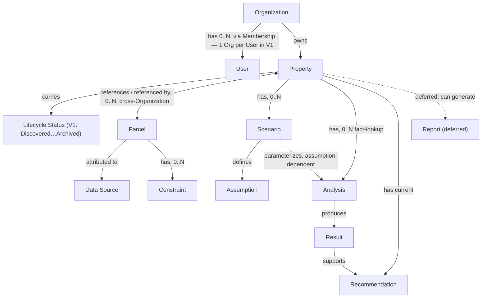

# Formetrix Core Domain Model

> This document defines the canonical business vocabulary of Formetrix.
>
> It is implementation-independent: no PostgreSQL tables, API endpoints, React
> components, or TypeScript structures are defined here. It exists so that
> future schema design, API design, and UI design all draw from the same
> concepts, named the same way, meaning the same thing — instead of each
> being invented ad hoc when its ticket comes up.
>
> Approved founder decisions (`management/FOUNDER_DECISIONS.md`) are treated
> as authoritative here, the same as FORMETRIX.md itself. Where this
> document still recommends something no founder decision or FORMETRIX.md
> section has settled, it is marked as a recommendation or an open question,
> not a decision.

**Status:** Founder-approved for the concepts covered by FD-0001–FD-0009
(`management/FOUNDER_DECISIONS.md`). Four non-blocking questions remain —
see §13.
**Governs:** conceptual vocabulary only. FORMETRIX.md remains the constitution;
where anything here appears to conflict with it, FORMETRIX.md wins and this
document is wrong and should be corrected.

---

## 1. Purpose

Formetrix's entire product exists to help a developer answer one question
(FORMETRIX.md §1): **"Should I pursue this property?"** Every concept in this
document earns its place by supporting that question — directly, the way
Property and Recommendation do, or in service of it, the way Assumption and
Data Source do.

This document exists because that question cannot be answered by a single
screen or a single table. It requires a shared vocabulary for the real-world
things being reasoned about — a property, the land under it, the assumptions
used to evaluate it, the analyses run against it, and the recommendation that
results — so that engineering, product, and AI-generated content all mean the
same thing when they use the same word.

## 2. Scope

In scope: the business concepts a real estate developer reasons about when
deciding whether to pursue a property, from first identifying an opportunity
through an early feasibility recommendation — matching FORMETRIX.md §4's
Version 1 Product Scope. Per FD-0001, Formetrix's long-term direction is to
become the operating system for a development project from acquisition
through completion — but Version 1 covers only the first stage of that
direction, and this document's Version 1 Boundary (§11) reflects that.

Out of scope for Version 1, per FORMETRIX.md §5 and FD-0001: full
architectural design, construction documents, detailed engineering, permit
management, construction management, property management (post-acquisition
operation of an owned asset), portfolio accounting, and general-purpose CRM
concepts. The architecture should not _block_ these future phases (FD-0001)
even though it does not build them now — see §5.4's lifecycle treatment of
Property for how that's accommodated without expanding Version 1 scope.

This document does not define: database schema, indexes, or constraints;
API contracts; UI components or screens; or AI prompt/model behavior. Those
are downstream of this document, not part of it.

## 3. Guiding Principles

These principles, drawn directly from FORMETRIX.md, shaped every definition
below:

- **One vocabulary, not one team's vocabulary.** A term means the same thing
  in product docs, in the schema, in the UI, and in AI-generated text
  (FORMETRIX.md §6, §25).
- **Distinguish fact from assumption from calculation from interpretation
  from recommendation, always** (§6, §16). This isn't a nice-to-have — it's
  why §8 of this document exists as its own section rather than a footnote.
- **Provenance is not optional.** Anything imported or derived should be
  traceable to where it came from (§7, §13).
- **Don't model what isn't needed yet.** A concept earns a place in the
  Version 1 domain, not by being interesting, but by being required to
  answer the guiding question (§8 Decision Filter, §21).
- **Surface uncertainty instead of resolving it silently.** This document
  practices what §7 preaches: unresolved business questions are listed in
  §13, not quietly decided by whichever answer was easiest to model.
- **Founder decisions are authoritative, not advisory.** Once
  `management/FOUNDER_DECISIONS.md` records a decision as Approved, this
  document states it as fact, not as "recommended" — the distinction
  between a recommendation and a decision matters (FORMETRIX.md §6's
  fact/assumption discipline applies to this document's own claims, too).

## 4. Canonical Vocabulary

| Term                                | One-line meaning                                                                                               |
| ----------------------------------- | -------------------------------------------------------------------------------------------------------------- |
| **Organization**                    | A company or business account using Formetrix.                                                                 |
| **User**                            | A person who authenticates into Formetrix.                                                                     |
| **Membership**                      | The relationship connecting a User to an Organization.                                                         |
| **Property**                        | A long-lived acquisition/development opportunity and workspace, carried through its lifecycle.                 |
| **PropertyWorkspace**               | The evaluation surface of a Property (1:1 in V1) that analysis modules attach to — schema refinement, §5.4a.   |
| **Parcel**                          | A legal or data-provider record of a specific piece of land.                                                   |
| **Project** _(deferred — see §5.5)_ | Not part of the Version 1 vocabulary; Property serves this role.                                               |
| **Scenario**                        | A named set of assumptions used to evaluate one possible outcome for a Property.                               |
| **Assumption**                      | A single input value — user-provided, imported, calculated, or estimated — used by a Scenario or Analysis.     |
| **Analysis**                        | A structured evaluation (zoning, feasibility, financial, spatial, risk, …) producing a Result.                 |
| **Constraint**                      | A condition that limits what can be built, at some confidence level from verified to unknown.                  |
| **Result**                          | The output of a single Analysis.                                                                               |
| **Recommendation**                  | The current, explainable answer to "should I pursue this property?" for a given Property.                      |
| **Report** _(deferred — see §5.13)_ | A generated, shareable snapshot of selected Property information; not built in the first implementation phase. |
| **Data Source**                     | The origin of an imported or externally retrieved value; the unit of provenance.                               |

## 5. Core Entity Definitions

Each entity below states what it means, what it explicitly does not mean,
and the specific clarifying questions the ticket asked for.

### 5.1 Organization

**Is:** a company or business account using Formetrix — the tenancy
boundary for data and billing.

**Is not:** a User. A solo developer using Formetrix still has (or is)
exactly one Organization; Organization is not proof of multiple people.

**Clarifications (resolved by FD-0002):**

- **Does data belong primarily to an Organization?** Yes. Organizations own
  business records, including Properties; Users create, edit, and author
  records on behalf of their Organization, but do not own them personally.
- **Can an Organization have multiple Users?** Yes — decided.
- **Can a User eventually belong to multiple Organizations?** Not in
  Version 1 — one User belongs to one Organization. Multi-organization
  membership is deferred (§12).
- **Are organization-level permissions expected later?** Yes — FD-0002
  defers fine-grained permissions. Architecture planning (`docs/AUTH_FLOW.md`,
  ADR-0029) now defines four membership roles (Owner, Admin, Member, Viewer)
  for invite/RLS design; module-scoped grants (e.g., financials-only) remain
  future scope beyond those roles.

### 5.2 User

**Is:** a person who signs in to Formetrix. Distinct from a role, a
profile, or a membership — a User is the authentication identity.

**Clarifications on the four distinctions asked for:**

- **Authentication identity** — the credential-holding account (handled by
  Supabase Auth per ADR-0002). This is the only part of "User" that is
  purely technical; everything else below is a business concept that
  happens to attach to it.
- **User profile** — the person's name, contact info, and preferences.
  Conceptually separate from the authentication identity so that profile
  data can be edited without touching credentials, and so a profile can
  exist even before an invite is accepted (see OQ-9, still open).
- **Organization membership** — see §5.3. A User without a Membership can
  authenticate but has no Organization context and therefore cannot own or
  view a Property.
- **Ownership or authorship of records** — per FD-0002, Property (and
  everything under it) is Organization-owned; a User "creates, edits, and
  authors records on behalf of their Organization." Individual records
  still track which User authored/last modified them, for traceability
  (FORMETRIX.md §7) — this is authorship, distinct from ownership.
  Authorship does not imply the authoring User retains any special access
  once they leave the Organization; ownership (Organization) governs
  access, authorship (User) governs the historical record.

### 5.3 Membership

Not one of the ticket's named "required core concepts," but necessary the
moment both Organization and User exist as separate entities. Recorded here
explicitly rather than left implicit, per §3's "don't silently resolve"
principle.

**Is:** the fact that a specific User belongs to a specific Organization.
In Version 1, this is a **one-to-one relationship per User** (FD-0002): a
User belongs to exactly one Organization at a time. It is still modeled as
its own concept, not a flat field on User, because (a) it can end — a
Membership ending doesn't delete the User — and (b) multi-organization
membership is explicitly deferred rather than ruled out (§12), so the
concept should not be modeled in a way that would require a breaking
change to support it later.

**Is not:** the User's identity or profile.

### 5.4 Property

**Is:** the opportunity a User or Organization is evaluating, **and the
long-lived workspace that carries it through its lifecycle** — this is the
most consequential update from FD-0004. Property is not replaced by a
different entity at acquisition; the same Property continues to represent
the development effort afterward. This is the entity every other concept
in this document ultimately relates back to.

**Is not:** a Parcel (the evaluation, not the land record — §5.6). Is not
replaced by a Project — Project is deferred (§5.5); Property fills that
role.

**Clarifications:**

- **Is Property the main workspace?** Yes — the most strongly grounded
  conclusion in this document. FORMETRIX.md §1 asks "should I pursue _this
  property_," docs/PRODUCT.md's every core module is scoped to a property,
  and docs/UI.md says every screen should help answer the property-level
  question.
- **Can one Property reference one or more Parcels?** Yes, many-to-many —
  see §5.6/FD-0005.
- **Does Property represent an opportunity rather than a legal parcel?**
  Yes (ADR-0011).
- **Can a Property be created before parcel data is known?** Yes — decided
  (FD-0003).
- **How does Property differ from Project?** Project does not exist in
  this model (§5.5); Property itself carries the lifecycle a separate
  "Project" entity might otherwise have represented (FD-0004).

**Lifecycle (new in this revision — FD-0004):**

Property is long-lived and carries a status through its lifecycle, rather
than the product replacing it with a different entity at acquisition. This
has a direct architectural consequence (see `management/DECISIONS.md`
ADR-0015): any future Property schema should include a status/lifecycle
field from the start, sized to accommodate the full lifecycle below, even
though only the Version 1 statuses are implemented now.

- **Version 1 statuses (in scope):** Discovered, Evaluating, Under
  Contract, Acquired, Archived. These cover acquisition and early
  feasibility — Formetrix's Version 1 focus (FORMETRIX.md §4, FD-0001).
- **Future statuses (deferred — do not build in Version 1):** Planning,
  Design, Permitting, Construction, Completed. These represent
  post-acquisition execution phases. FD-0004 is explicit that documenting
  these must not cause Version 1 feature expansion — no screens, workflows,
  or logic for these phases should be built now. They are named here only
  so the status field's shape doesn't need to change later.

### 5.4a PropertyWorkspace — schema refinement (FM-0007 / ADR-0027)

**Is:** the **evaluation surface** of a Property — the container that analysis
modules (Parcel links, Zoning, Constraints, Assumptions, Scenario/Financial,
Recommendation, Documents, Activity) attach to. Introduced by the core schema
design (FM-0007, `docs/DATABASE_SCHEMA.md`) as a **1:1 refinement** of §5.4: it
does not replace Property or contradict "Property is the primary workspace" —
Property remains the long-lived, Organization-owned opportunity record, and
PropertyWorkspace is the mutable evaluation container hung off it so the core
Property record stays small and analysis modules have a single, stable
attachment point.

**Is not:** a Project (§5.5) — it carries no lifecycle or ownership, only
evaluation attachment. It is 1:1 with Property in Version 1; modeling it as its
own entity leaves room for more than one evaluation workspace per Property later
without a breaking change, but that is deferred.

**Clarification:** this concept is a downstream schema/organizational construct,
not a new business concept the user names — a user still reasons about "the
Property." It is recorded here per this document's change-control rule (§15)
because the schema and the shipped `/property/[id]` workspace (FM-0029) both use
it.

### 5.5 Project — deferred

No source document — not FORMETRIX.md, not docs/PRODUCT.md, not
docs/ROADMAP.md, not docs/DATABASE.md — uses "Project" as a business
concept, and FD-0004 confirms directly: "Project remains deferred as a
separate entity unless future product needs prove it necessary." Property
now explicitly carries what a "Project" entity might otherwise have
represented — its long-lived lifecycle (§5.4) — which removes the
strongest argument for introducing Project at all. Recorded as ADR-0013
(deferred) and reaffirmed by FD-0004.

### 5.6 Parcel

**Is:** a legal or data-provider representation of a specific piece of
land — typically sourced from Regrid (ADR-0006), identified by a
provider-specific parcel ID, and carrying source geometry.

**Is not:** the Property. A Parcel is a fact record about land; it does not
know it is being evaluated, by whom, or why.

**Clarifications (resolved by FD-0005):**

- **Can one Property reference multiple Parcels?** Yes.
- **Can a Parcel be referenced by multiple Properties, including across
  different Organizations?** Yes — decided. FD-0005: "The same Parcel may
  be referenced by Properties belonging to different Organizations."
- **Must this privacy boundary hold?** Yes, as a hard product requirement,
  not just an engineering recommendation: "Shared parcel reference data
  must never expose one Organization's private Property information to
  another Organization" (FD-0005). The land record can be shared; the fact
  that a specific Organization is evaluating it cannot be.
- **How are source data and source identifiers preserved?** Via Data
  Source (§5.14) — FD-0005 explicitly requires "source identifiers,
  provider, retrieval date, geometry provenance, and uncertainty" to be
  preserved conceptually, consistent with FORMETRIX.md §13.
- **How should parcel geometry be treated?** Per FORMETRIX.md §14: source
  geometry must be kept separate from any geometry Formetrix derives, and
  never overwritten by it. Units, coordinate system, and precision
  limitations must be explicit wherever geometry is shown.
- **How should uncertain or conflicting parcel data be represented
  conceptually?** As multiple candidate values for the same attribute,
  each attributed to its own Data Source, with the conflict surfaced
  rather than silently resolved — FORMETRIX.md §7; reaffirmed by FD-0005's
  "uncertainty must be preserved conceptually."

### 5.7 Scenario

**Is:** a named set of development and financial assumptions used to
evaluate one possible outcome for a Property (FD-0006) — e.g., "as-of-right
development" vs. "with a variance."

**Is not:** an Analysis. A Scenario is a set of inputs; an Analysis is the
process that consumes inputs and produces a Result (§5.9).

**Clarifications (Scenario's Version 1 inclusion decided by FD-0006):**

- **Is Scenario part of Version 1?** Yes — decided, no longer "Likely."
- **Can one Property have multiple Scenarios?** Yes.
- **What assumptions belong to a Scenario?** Anything varied to model a
  different outcome for the same Property — density, cost per square
  foot, cap rate, timeline, etc.
- **May Scenarios be compared?** Yes, decided (FD-0006). The specific UI
  mechanism for comparison is not decided — remains open (OQ-6, narrowed
  from "whether" to "how").
- **May a baseline Scenario be supported?** Yes, permitted (FD-0006: "a
  baseline Scenario may be supported") — not mandated, but not precluded.
- **Must Scenario-specific assumptions and analyses remain distinguishable
  from each other?** Yes, explicitly required by FD-0006 — a Scenario's
  assumptions and the Analyses they parameterize must not be conflated
  with another Scenario's.

### 5.8 Assumption

**Is:** a single input value used by a Scenario or Analysis — the atomic
unit FORMETRIX.md §4 refers to as "what assumptions are being used" and §6
names explicitly as one of the six categories of information the product
must distinguish (see §8).

**Is not:** a fact. An Assumption may be _informed_ by a fact but is
recorded and treated as an assumption, not silently promoted to fact
status.

**Clarifications (all four requested fields, confirmed by FORMETRIX.md
§13's provenance requirements):**

- **Source** — who or what produced this value: a specific User, an
  imported default, or a system calculation.
- **Unit** — required and explicit; FORMETRIX.md §14/§15 both require
  units to be stated, not implied.
- **Effective date** — when this assumption is/was valid.
- **Confidence or certainty** — where this Assumption sits on the
  fact-to-uncertain spectrum defined in §8.
- **Provenance category** — user-provided, imported, calculated, or
  estimated, per FORMETRIX.md §6.

### 5.9 Analysis

**Is:** a structured evaluation — zoning, feasibility, spatial, financial,
or risk — now confirmed Required in Version 1 by FD-0007.

**Is not:** a single universal thing that always requires a Scenario.
FD-0007 explicitly confirms the refinement this document already proposed,
rather than the flat "Scenario has Analyses" relationship offered as an
example in the original modeling ticket:

- Some Analysis types are **fact-lookup**, not assumption-dependent — e.g.,
  "what is this parcel's zoning classification" — and attach directly to
  Property/Parcel. FD-0007: "Some Analyses may apply directly to a
  Property or Parcel, such as factual zoning or parcel-condition
  analysis."
- Other Analysis types are **assumption-dependent** — e.g., financial
  feasibility — and attach to a Scenario. FD-0007: "Some Analyses may
  depend on a Scenario, such as development feasibility or financial
  viability."
- FD-0007 states directly: "The domain model must not force every
  Analysis to belong to a Scenario" — settling this as approved product
  direction, not just an engineering opinion.

**Clarifications:**

- **Is Analysis one concept or a category?** A category. Whether it
  becomes one polymorphic table or several typed ones remains an open,
  non-blocking schema question (OQ-8).
- **Do analyses belong to a Property or a Scenario?** Both, depending on
  type — see above.
- **How should results, assumptions, sources, confidence, and timestamps
  be preserved?** FD-0007: "Analysis results must preserve inputs,
  assumptions, methodology, source, timestamp, and confidence where
  relevant" — this is now a decided requirement, not a recommendation.
- **How does deterministic analysis differ from AI interpretation?**
  Deterministic Analysis must not depend on probabilistic model output
  (FORMETRIX.md §15). AI may _explain_ a Result or synthesize multiple
  Results into a Recommendation, but does not compute the Result itself.

### 5.10 Constraint

**Is:** a condition that limits possible development — zoning, setbacks,
parcel geometry, access, environmental limits, or similar — directly named
in FORMETRIX.md §4.

**Confidence tiers**, mapped onto the same six-category taxonomy used
throughout this document (§8) rather than inventing a parallel one:

| Ticket's term                               | Maps to (§8 category)                  |
| ------------------------------------------- | -------------------------------------- |
| Verified constraint                         | Verified fact                          |
| Inferred constraint                         | Formetrix calculation / interpretation |
| Possible constraint                         | Estimated value                        |
| Missing information requiring investigation | Uncertain or missing information       |

### 5.11 Result

Not named as a "required core concept" in the original modeling ticket, but
necessary as the explicit output of an Analysis. A Result carries the
analysis's output value(s), confidence, and the Assumptions/Data Sources
that produced it.

### 5.12 Recommendation

**Is:** the conclusion that answers "should I pursue this property?" for a
given Property (FD-0008) — the literal answer to FORMETRIX.md §1's guiding
question.

**Is not:** a Scenario, Analysis, or Result on its own — it _synthesizes_
evidence across "Property facts, Parcels, Scenarios, Analyses, constraints,
and risks" (FD-0008) into a decision-support conclusion.

**Clarifications (attachment point resolved by FD-0008):**

- **Does it belong to a Property, Scenario, Analysis, or combined
  evaluation?** Property — decided, not just recommended.
- **Can there be a Recommendation per Scenario?** Not required in Version
  1. FD-0008: "Future support for scenario-specific recommendations may be
     evaluated later, but is not required now" (deferred — §12).
- **How do evidence and assumptions support it?** By explicit reference —
  traceable back to the specific Results, Assumptions, and Constraints
  that produced it (FORMETRIX.md §16).
- **How is uncertainty communicated?** By surfacing the confidence and
  gaps already present in its supporting Results and Constraints
  (FORMETRIX.md §7).
- **Why must it be explainable?** FD-0008 and FORMETRIX.md §16 both
  require it directly.
- **Why must it not overwrite underlying facts or calculations?** FD-0008
  states this directly: Recommendation "must not overwrite facts,
  calculations, or underlying analysis results" — it is an
  _interpretation_ layered on top of them (§8), never itself a verified
  fact.

### 5.13 Report — deferred, pending prioritization

**Is:** a generated, shareable snapshot of selected Property information,
assumptions, analyses, and recommendations.

**Version 1 status, decided by FD-0009:** Report is **not required for the
first implementation phase.** It remains a likely Version-1-or-near-Version-1
capability, pending product prioritization — this is a materially different
status than "Requires founder decision" (this document's prior label); the
founder has decided it is deferred, and has also pre-decided its shape for
whenever it is built:

- **Immutable, snapshot-based:** decided, not merely recommended. A future
  Report "should represent a shareable snapshot [and] preserve the state
  of selected facts, assumptions, analyses, and recommendations at
  generation time" (FD-0009), and must "avoid changing silently when live
  data changes."
- **Versioning:** decided — a future Report "should... support
  versioning."
- **PDF generation:** explicitly deferred until prioritized separately
  from Report itself (FD-0009).

### 5.14 Data Source

**Is:** the origin of an imported or externally retrieved value — Regrid,
a government record, a zoning source, user-entered information, or an
internal Formetrix calculation.

**Is not:** a business workspace entity the user directly browses, the way
Property is. Data Source is closer to a cross-cutting provenance
attribute than a standalone workspace object — but per FORMETRIX.md §13,
it should still be modeled as its own referenceable record, not a
free-text label repeated on every fact. FORMETRIX.md §24 uses the term
"data providers" for what this document calls "Data Source" — the same
concept, worth reconciling to one term (Inconsistency I-4, still open —
see the accompanying ticket response).

**Required fields, per FORMETRIX.md §13 and reaffirmed by FD-0005 for
Parcel specifically:** provider, retrieval date, effective date,
confidence, source identifier, transformation history.

## 6. Relationships

The relationships below reflect the founder-approved model. Two of them
(Analysis's attachment point, and Parcel's cross-Property/cross-Organization
visibility) are refinements of the original modeling ticket's suggested
relationships that FD-0007 and FD-0005 have now formally confirmed, not
just recommendations that happened to survive review.

- **Organization has Users, through Membership. One Organization : many
  Users; one User : one Organization in Version 1.** Decided (FD-0002).
- **Organization owns Properties.** Decided (FD-0002/FD-0003).
- **Property references Parcels (0..N), and a Parcel may be referenced by
  multiple Properties across different Organizations (0..N).**
  Many-to-many. Decided (FD-0005).
- **Property has Scenarios (0..N).** Decided (FD-0006).
- **Scenario defines Assumptions.** Decided (FD-0006).
- **Some Analyses are parameterized by a Scenario's Assumptions; others
  attach directly to Property/Parcel as fact-lookups.** Decided (FD-0007).
- **Analyses produce Results.** (§5.9/§5.11)
- **Results support a Property's Recommendation.** Decided, attachment
  point is Property (FD-0008).
- **A Property can eventually generate Reports, which would snapshot
  selected Assumptions, Analyses, Results, and the Recommendation.**
  Deferred — Report is not built in the first implementation phase
  (FD-0009), so this relationship is documented for later, not active now.
- **Parcel attributes, and any imported or derived value generally, retain
  Data Source provenance.** Confirmed, generalized per FORMETRIX.md §13.
- **Property carries a lifecycle status**, decided by FD-0004 — new
  relationship not present in the prior revision of this document (§5.4).

### Conceptual relationship diagram

**This is a conceptual relationship diagram, not a physical database
schema.** It shows which business concepts relate to which and roughly how
— it does not define tables, columns, keys, cardinality constraints, or
indexes. Solid arrows are structural, decided relationships; dashed arrows
are either "parameterizes/is referenced by" relationships, or (in Report's
case) a relationship that is documented but not active in Version 1.
Schema design is out of scope for this document (see §2).

## 7. Ownership and Tenancy

- **Tenancy boundary:** Organization (§5.1). All business data — Property
  and everything beneath it — is Organization-scoped, decided by FD-0002/
  FD-0003, not merely recommended.
- **Authorship vs. ownership:** individual records track which User
  authored/last modified them, but access control follows Organization
  ownership — FD-0002: "Users create, edit, and author records on behalf
  of their Organization." A departing employee's authored Assumptions
  remain visible to their former Organization; their access does not.
- **Cross-Organization data sharing:** Parcel and Data Source records are
  the one place shared visibility is decided (FD-0005) — externally-sourced
  facts about land, not any Organization's private evaluation of it. This
  must not leak which Organizations have Properties referencing a given
  Parcel.
- **Finer-grained permissions within an Organization:** explicitly deferred
  (FD-0002) — Version 1 has no role-based access within an Organization.
- **Solo-user case:** a single developer with no team still has exactly
  one Organization — Organization is the tenancy unit, not evidence of a
  team.

## 8. Facts, Assumptions, Calculations, and Interpretations

FORMETRIX.md states this taxonomy twice, worded slightly differently each
time (§6 and §16 — Inconsistency I-4, still open). This document
harmonizes them into one six-category model (ADR-0014), used consistently
throughout:

| Category                             | Meaning                                                                                  | Example in this domain                                       |
| ------------------------------------ | ---------------------------------------------------------------------------------------- | ------------------------------------------------------------ |
| **Verified fact**                    | Confirmed, sourced, not open to interpretation                                           | A parcel's recorded lot size from Regrid                     |
| **User-provided assumption**         | Entered by a person, not verified externally                                             | A user's assumed construction cost/sqft                      |
| **Formetrix calculation**            | Deterministic output of a defined formula                                                | A Result from a financial Analysis                           |
| **Formetrix interpretation**         | AI-generated synthesis or explanation, not a formula                                     | An AI-written explanation of why a Result came out as it did |
| **Estimated value**                  | A default or inferred value, lower confidence than a verified fact but not user-asserted | An inferred zoning classification pending confirmation       |
| **Uncertain or missing information** | Known to be absent or unresolved                                                         | A parcel attribute no Data Source has supplied               |

Every entity in §5 that carries a value with confidence — Assumption,
Constraint, Result, Recommendation — should be understood as expressing
that value in terms of this table. Recommendation, specifically, is always
an **interpretation**: it may _cite_ facts and calculations, but it is
never itself a verified fact, and must not be presented as one
(FORMETRIX.md §7; FD-0008).

## 9. Provenance and Traceability

Every Data Source record should carry, per FORMETRIX.md §13: provider,
retrieval date, effective date, confidence, source identifier, and
transformation history — reaffirmed for Parcel specifically by FD-0005.

Every value that isn't a User-provided Assumption should be traceable to
the Data Source that produced it. Every Result should be traceable to the
Assumptions and Data Sources that fed it (FD-0007). Every Recommendation
should be traceable to the Results it drew on (FD-0008). This chain — Data
Source → fact/Assumption → Result → Recommendation — is what makes
FORMETRIX.md §16's explainability requirement possible.

## 10. Lifecycle Examples

Illustrative, not exhaustive, and do not imply any specific UI flow.

**Example A — early exploration:**
A user creates a Property before any Parcel is confirmed (§5.4), with
status Discovered. Formetrix later matches it to a Parcel via Regrid
(§5.6); the Parcel's attributes arrive with Data Source provenance
(§5.14). A fact-lookup Analysis determines zoning classification directly
from the Parcel — no Scenario required (§5.9).

**Example B — feasibility comparison:**
The same Property, now Evaluating, gets two Scenarios: "as-of-right" and
"with variance" (§5.7), each with its own density and cost Assumptions
(§5.8). Each Scenario parameterizes a financial Analysis, producing two
Results (§5.9/§5.11). A Recommendation is formed by weighing both Results
against the Property's Constraints (§5.10/§5.12).

**Example C — sharing findings:**
Report is deferred in Version 1 (§5.13); this example is documented for
when it is built, not as current behavior. A user would generate a Report
snapshotting the current Assumptions, Results, and Recommendation to share
with a partner. New Parcel data arriving later would change the live
Recommendation without changing the already-generated Report, by design.

**Example D — lifecycle continuity (new — FD-0004):**
A Property moves from Discovered through Evaluating to Under Contract and
then Acquired — the same Property record throughout, never replaced by a
separate "Project" entity. Formetrix does not build any post-acquisition
workflow for it in Version 1: no Planning, Design, Permitting, or
Construction screens exist. The status field simply reflects that the
Property has been acquired; nothing about how the product functions
changes as a result, per FD-0004's explicit instruction that documenting
future statuses "must not cause Version 1 feature expansion."

## 11. Version 1 Domain Boundary

Final, founder-approved (FD-0001–FD-0009). No concept below is labeled
"Requires founder decision" — that label described this document's prior
revision, before the founder review this ticket resolved.

| Concept                                                                                 | Status                               | Reasoning                                                                                                |
| --------------------------------------------------------------------------------------- | ------------------------------------ | -------------------------------------------------------------------------------------------------------- |
| Organization                                                                            | **Required in V1**                   | FD-0002; explicit core entity (docs/DATABASE.md); needed for RLS (FORMETRIX.md §19)                      |
| User                                                                                    | **Required in V1**                   | FD-0002; explicit core entity; needed for auth (Milestone 1)                                             |
| Membership                                                                              | **Required in V1**                   | FD-0002; one-Organization-per-User in V1, decided                                                        |
| Property                                                                                | **Required in V1**                   | FD-0003/FD-0004; the primary, long-lived workspace                                                       |
| Parcel                                                                                  | **Required in V1**                   | FD-0005; explicit core entity; FORMETRIX.md §14                                                          |
| Scenario                                                                                | **Required in V1**                   | FD-0006 — upgraded from "Likely" in the prior revision                                                   |
| Assumption                                                                              | **Required in V1**                   | FORMETRIX.md §4/§6; reaffirmed by FD-0006/FD-0007                                                        |
| Constraint                                                                              | **Required in V1**                   | FORMETRIX.md §4, "what development constraints may apply"                                                |
| Analysis                                                                                | **Required in V1**                   | FD-0007 — upgraded from "Likely" in the prior revision                                                   |
| Recommendation                                                                          | **Required in V1**                   | FD-0008; the literal answer to FORMETRIX.md §1's guiding question                                        |
| Data Source                                                                             | **Required in V1**                   | Provenance is non-negotiable per FORMETRIX.md §7/§13                                                     |
| Project                                                                                 | **Deferred**                         | FD-0004; Property carries its role; not needed "unless future product needs prove it necessary"          |
| Report                                                                                  | **Deferred, pending prioritization** | FD-0009 — not required for the first implementation phase, but pre-decided in shape for when it is built |
| Multi-organization User membership                                                      | **Deferred**                         | FD-0002                                                                                                  |
| Full lifecycle workflow modules (Planning, Design, Permitting, Construction, Completed) | **Deferred**                         | FD-0004; documented in §5.4 so the status field's shape doesn't need to change later, but not built      |
| Construction management                                                                 | **Deferred**                         | FORMETRIX.md §5; FD-0001                                                                                 |
| Permitting management                                                                   | **Deferred**                         | FORMETRIX.md §5; FD-0001                                                                                 |
| Portfolio management                                                                    | **Deferred**                         | FORMETRIX.md §26 ("Portfolio intelligence," Long-Term Vision)                                            |
| PDF reporting                                                                           | **Deferred**                         | FD-0009, deferred separately from Report itself                                                          |

## 12. Deferred Concepts

- **Project** (§5.5) — Property carries its role; deferred unless future
  product needs prove it necessary (FD-0004).
- **Full lifecycle workflow modules** (§5.4) — Planning, Design,
  Permitting, Construction, Completed statuses are named so Property's
  status field doesn't need a breaking change later, but no feature work
  for them exists in Version 1 (FD-0004).
- **Construction management, permitting management, portfolio management**
  — explicitly out of Version 1 scope (FORMETRIX.md §5/§26, FD-0001).
- **Multi-organization User membership** — one User : one Organization in
  Version 1 (FD-0002).
- **Role-based permissions within an Organization** — org-level tenancy is
  decided for V1; finer-grained roles are explicitly later (FD-0002).
- **Report implementation and PDF generation** — not required for the
  first implementation phase; shape pre-decided for when it is built
  (FD-0009).
- **Scenario-specific Recommendations** — a single Property-level
  Recommendation is Version 1's model; per-Scenario recommendations "may
  be evaluated later" (FD-0008).
- **Scenario comparison UI mechanism** — that Scenarios may be compared is
  decided (FD-0006); how is not (§13, OQ-6).

## 13. Open Questions

Written for the Founder and CTO to answer. All five previously-blocking
questions were resolved by FD-0001–FD-0009 (see "Resolved," below) and
have been moved out of this section into the relevant §5 clarifications,
per this document's own Change-Control Rules (§15) — not deleted, to
preserve traceability.

### Resolved by FD-0001–FD-0009 (moved from Blocking, formerly OQ-1–OQ-5, OQ-7, OQ-11)

| #     | Question                                                        | Resolved by | Now documented in |
| ----- | --------------------------------------------------------------- | ----------- | ----------------- |
| OQ-1  | Can one Organization have multiple Users?                       | FD-0002     | §5.1              |
| OQ-2  | Can one User belong to multiple Organizations?                  | FD-0002     | §5.1, §5.3        |
| OQ-3  | Is Property ownership strictly Organization-level?              | FD-0003     | §5.1, §7          |
| OQ-4  | Should Parcel data be shared across Organizations?              | FD-0005     | §5.6, §7          |
| OQ-5  | Is Property strictly pre-acquisition, or does it track further? | FD-0004     | §5.4              |
| OQ-7  | One Recommendation per Property, or per Scenario?               | FD-0008     | §5.12             |
| OQ-11 | Is Report in Version 1? What shape?                             | FD-0009     | §5.13             |

### Remaining (non-blocking — can be resolved during or after the relevant feature ticket)

- **OQ-6:** _(narrowed by FD-0006 — the "whether" is resolved, the "how"
  is not)_ How are multiple Scenarios for the same Property compared in
  the UI — side by side, one at a time, or another pattern? (§5.7)
- **OQ-8:** Should Analysis be one polymorphic entity with a "type" field,
  or several distinct entities (financial, zoning, etc.)? (§5.9)
- **OQ-9:** Can a User profile exist before an invite is accepted (e.g.,
  an Organization pre-adds a teammate by email)? (§5.2)
- **OQ-10:** What confidence scale does §8's table actually use — a fixed
  enum, a percentage, or something else? (§8)

No blocking questions remain as of this revision.

## 14. Initial Recommended Model

Summarizing §5–§11: Version 1's domain centers on a **Property** — a
long-lived opportunity and development workspace carrying a lifecycle
status, owned by an **Organization** whose **Users** connect to it through
a one-per-User **Membership**. A Property references one or more
**Parcels**, shareable across Organizations but never exposing which
Organization is evaluating them, each carrying **Data Source**-attributed
facts and **Constraints**. A Property can hold multiple **Scenarios**,
comparable to one another, each defining **Assumptions** that parameterize
assumption-dependent **Analyses**; fact-lookup Analyses attach directly to
Property/Parcel. Every Analysis produces a **Result**, and Results support
a Property's single, current **Recommendation** — the explainable answer
to "should I pursue this property?" **Report** and **Project** are both
deferred: Report pending prioritization with its shape pre-decided, Project
because Property already carries what it would have represented.

Eleven concepts are Required in Version 1. Eight items — including Project,
Report, and the full post-acquisition lifecycle — are explicitly deferred,
each with founder-approved reasoning rather than an open question.

## 15. Change-Control Rules

Mirroring the pattern already established in `management/*.md`:

- This document is maintained by both human contributors and AI
  engineering agents, the same as `management/`.
- A term's meaning, once shipped in code (a table, a type, an API field),
  is not silently redefined here — record the change as a decision in
  `management/DECISIONS.md` (architecture) or
  `management/FOUNDER_DECISIONS.md` (product) first, then update this
  document to match.
- **Founder decisions (`management/FOUNDER_DECISIONS.md`) are the
  authoritative source for resolving an Open Question (§13).** When one is
  resolved, move it out of §13 into the relevant §5 subsection — as this
  revision did for FD-0001–FD-0009 — rather than deleting it, and record
  its architectural consequences in `management/DECISIONS.md` if any exist
  (see ADR-0015).
- Do not remove a concept whose data already exists in the running system,
  even if this document's recommendation later changes to Deferred —
  supersede the recommendation and explain why, don't erase the history.
- New concepts are added to §4 (Canonical Vocabulary) and given a full §5
  subsection; they are not introduced solely inside a ticket or a code
  comment.
- This document does not get marked "Required in V1" or "Deferred" for
  anything without the reasoning column in §11 being filled in — a label
  without a reason is exactly the kind of unexplained assertion
  FORMETRIX.md §7 prohibits.
